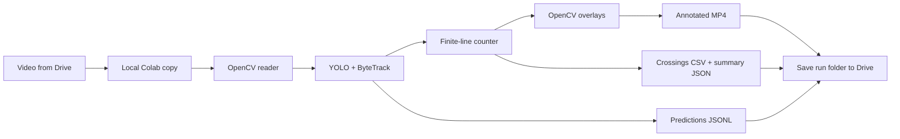

# Architecture

`pipeline.py` owns the lifecycle of one video run. `tracker.py` wraps YOLO's
ByteTrack integration with persistent state. A new tracker is created for each
run. `detector.py` also exposes detection-only inference for a first-frame check.

Objects use original-frame pixel boxes `[x1, y1, x2, y2]`, a COCO class ID,
confidence, and optional track ID. Unconfirmed detections have no ID and cannot
be counted. Only the current frame is held in memory; predictions stream to disk.

## Counting geometry

Each track is represented by its bounding box's bottom-center. Its signed
perpendicular distance from the directed line determines its side. Points within
`line_margin_px` of the line do not change the last stable side. When stable sides
differ, the interpolated movement must intersect the finite line segment.

For a left-to-right horizontal line, negative means above and positive means
below (image y increases downward). Direction names are geometric, not compass
directions. The notebook explains this when configuring the line.

Each track ID counts at most once in a run. Class is the majority of observed
classes before counting. Long visibility gaps discard position history to avoid
inferring a crossing across a disappearance. Counted IDs remain remembered.
This is not a guarantee of one count per physical vehicle: identity switches can
cause double counts, and missed detections or gaps can miss crossings.

## Media and persistence

Input timestamps are approximated as frame index / FPS; use constant-frame-rate
video. Encoded output may receive one pixel of right/bottom padding for odd
dimensions. Output has no audio. An optional ffmpeg step produces H.264 video
for browser playback. Output directories must be new to protect prior runs.
Failed runs can leave partial files; use a new directory when retrying.
